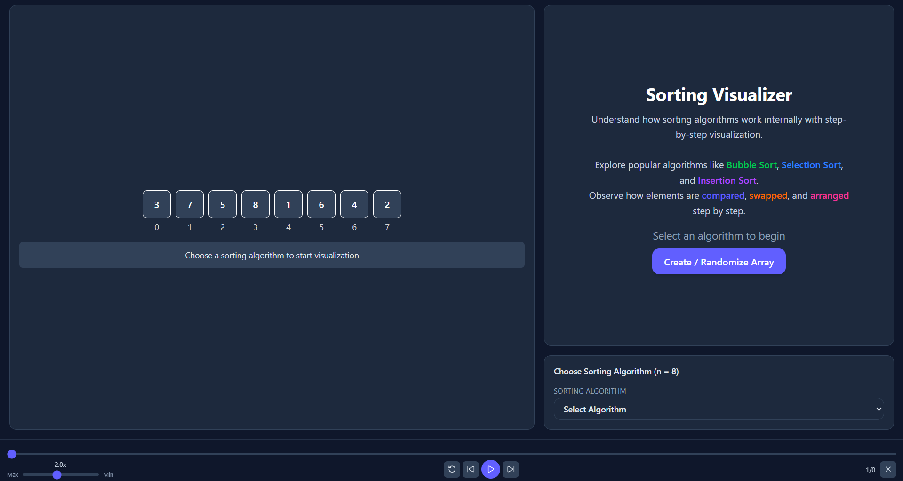

# DSA Visualizer

An interactive **Data Structures & Algorithms Visualizer** built to make core concepts intuitive through **step-by-step animations, state highlighting, and synchronized code execution**.

---

## Live Demo
> (https://dsa-visualizer-client.vercel.app/)

---

## Features

### Array Visualizer
- Insert, Delete, Search, Reverse, Min, Max operations
- Step-by-step execution with dynamic messages
- Visual state representation:
  - Searching
  - Found
  - Deleted
  - Inserted
- Adjustable speed control
- Code highlighting synced with execution

---

### Sorting Visualizer (In Progress)
- Bubble Sort
- Selection Sort
- Insertion Sort
- Step-by-step visualization with:
  - Comparisons
  - Swaps
  - Iteration tracking
- Dynamic state coloring and explanations

---

### 🎯 Learning-Oriented Design
- Each step explains **what is happening internally**
- Focus on **logic clarity, not just animation**
- Code + Visualization sync for better understanding

---

## Goal of the Project

Most platforms show *what happens*.

This project focuses on:
> **Why it happens and how it happens step-by-step**

---

## 🛠️ Tech Stack

- **Frontend:** React.js  
- **Styling:** Tailwind CSS  
- **State Management:** React Hooks  
- **Routing:** React Router  
- **Icons:** Lucide React  

---

## Project Structure

```

src/
│
├── assets/
│
├── components/
│   ├── ArrayDisplay.jsx
│   ├── Code.jsx
│   ├── CodeVisual.jsx
│   ├── Footer.jsx
│   ├── MessageBox.jsx
│   ├── Navbar.jsx
│   ├── PlayBar.jsx
│   ├── PlayerBar.jsx
│   ├── Quiz.jsx
│   ├── Sitemap.jsx
│   ├── TopicContentAlgo.jsx
│   ├── TopicContentDS.jsx
│   └── WorkingOnIt.jsx
│
├── data/
│   ├── algorithm/
│   │   ├── backtracking/
│   │   ├── divide-and-conquer/
│   │   ├── sorting/
│   │   │   ├── bubbleSortData.js
│   │   │   ├── insertionSortData.js
│   │   │   └── selectionSortData.js
│   │   └── topics.js
│   │
│   └── data-structure/
│       ├── ArrayData.js
│       ├── LinkedListData.js
│       ├── QueueData.js
│       ├── StackData.js
│       └── topics.js
│
├── features/
│   ├── algorithm/
│   │   ├── backtracking/
│   │   ├── sorting/
│   │   │   ├── components/
│   │   │   │   ├── ArrayCreator.jsx
│   │   │   │   ├── SortingHeader.jsx
│   │   │   │   └── SortingSelector.jsx
│   │   │   │
│   │   │   ├── logic/
│   │   │   │   ├── bubbleSort.js
│   │   │   │   ├── helperFunctions.js
│   │   │   │   ├── insertionSort.js
│   │   │   │   └── selectionSort.js
│   │   │   │
│   │   │   └── SortingVisual.jsx
│   │
│   └── data-structure/
│       ├── array-visualizer/
│       │   ├── components/
│       │   │   ├── ArrayCreator.jsx
│       │   │   ├── ArrayHeader.jsx
│       │   │   └── OperationSelector.jsx
│       │   │
│       │   ├── logic/
│       │   │   ├── deletion.js
│       │   │   ├── helperFunctions.js
│       │   │   ├── insertion.js
│       │   │   ├── max.js
│       │   │   ├── min.js
│       │   │   ├── reverse.js
│       │   │   └── search.js
│       │   │
│       │   └── Array.jsx
│       │
│       ├── LinkedList.jsx
│       ├── Queue.jsx
│       └── Stack.jsx
│
├── pages/
│   ├── AboutPage.jsx
│   ├── HomePage.jsx
│   ├── LoginPage.jsx
│   ├── PageNotFoundPage.jsx
│   ├── SignupPage.jsx
│   ├── SubTopicPageAlgo.jsx
│   ├── TopicListPage.jsx
│   ├── TopicPageAlgo.jsx
│   ├── TopicPageDS.jsx
│   └── VisualPageDS.jsx
│
├── routes/
│   └── AppRoutes.jsx
│
├── styles/
│
└── utils/

```


---

## 🎮 How It Works

1. Choose a data structure or algorithm  
2. Select an operation  
3. Click **Start Visualization**  
4. Watch:
   - Array changes
   - Step messages update
   - Code lines highlight  

---

## Demo Preview
> ()

---

## Upcoming Features

- Linked List Visualizer (with pointer animation)
- Cycle Detection (Floyd’s Algorithm)
- Graph Algorithms Visualization
- Tree Visualizer (BST, Traversals)
- Step-by-step explanation mode
- Mobile UI optimization

---

## Unique Highlights

- Clean and minimal UI focused on learning
- Step messages split into:
  - Explanation
  - Variable states (i, j, etc.)
- Legend system for color understanding
- Smooth animation with controlled speed

---

## Installation & Setup

```bash
# Clone the repository
git clone https://github.com/AnujPathak205/dsa-visualizer-client.git

# Navigate to project
cd dsa-visualizer

# Install dependencies
npm install

# Start development server
npm run dev

```

## Why This Project Matters

- Strengthens understanding of Data Structures & Algorithms  
- Demonstrates ability to:
  - Build complex UI systems  
  - Manage state effectively  
  - Visualize algorithms clearly  

---

## Contributing

Contributions are welcome!

If you would like to contribute:

- Open an issue to discuss bugs or features  
- Suggest improvements or enhancements  
- Add new data structure or algorithm visualizations  

## Author

**Anuj Pathak**
### Email
anujpathakanuj371@gmail.com
### LinkedIn
https://www.linkedin.com/in/anuj-pathak-22876835b/
### GitHub
https://github.com/AnujPathak205/

## Support
If you like this project, consider giving it a ⭐ on GitHub!

